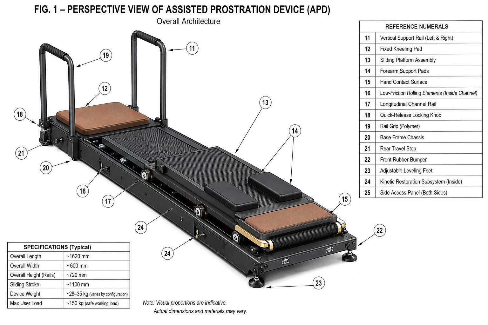
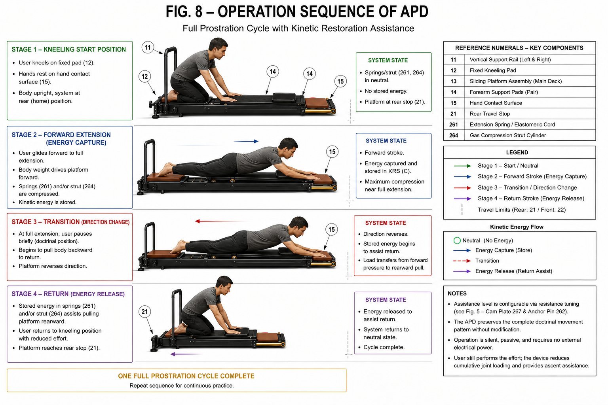
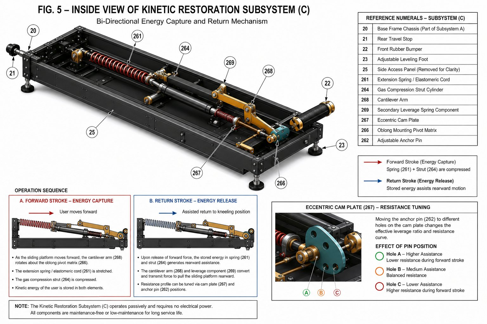
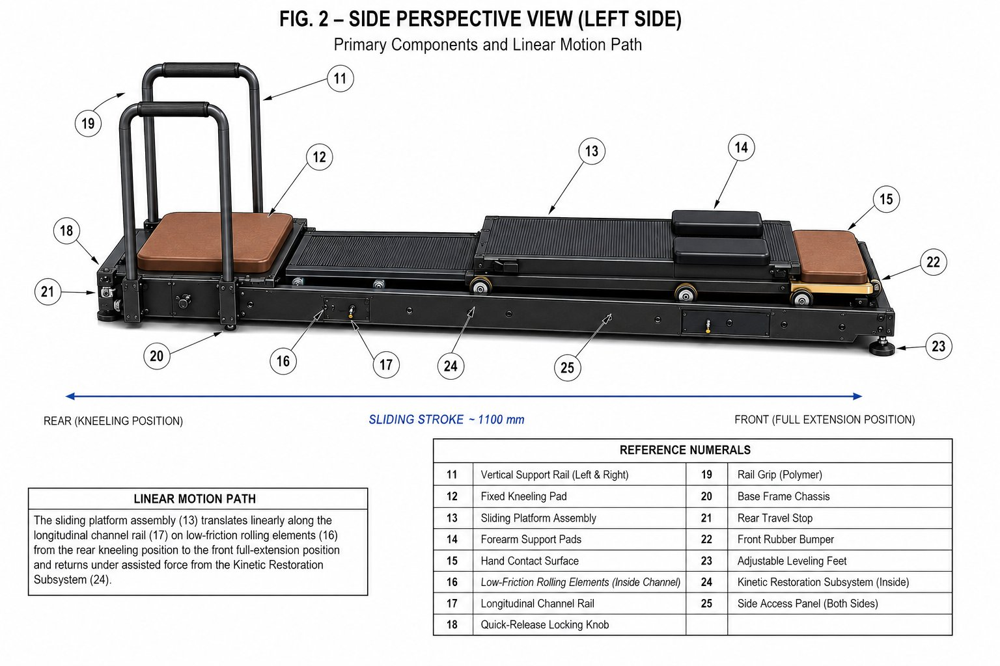
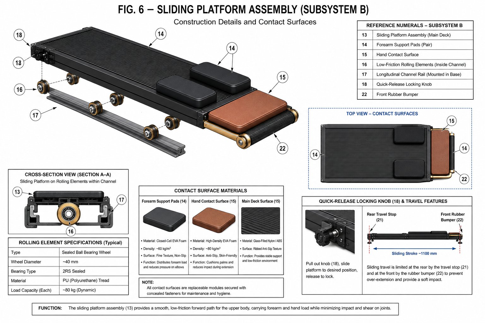
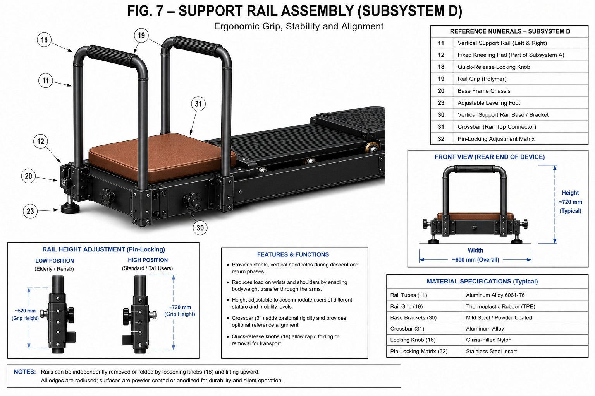
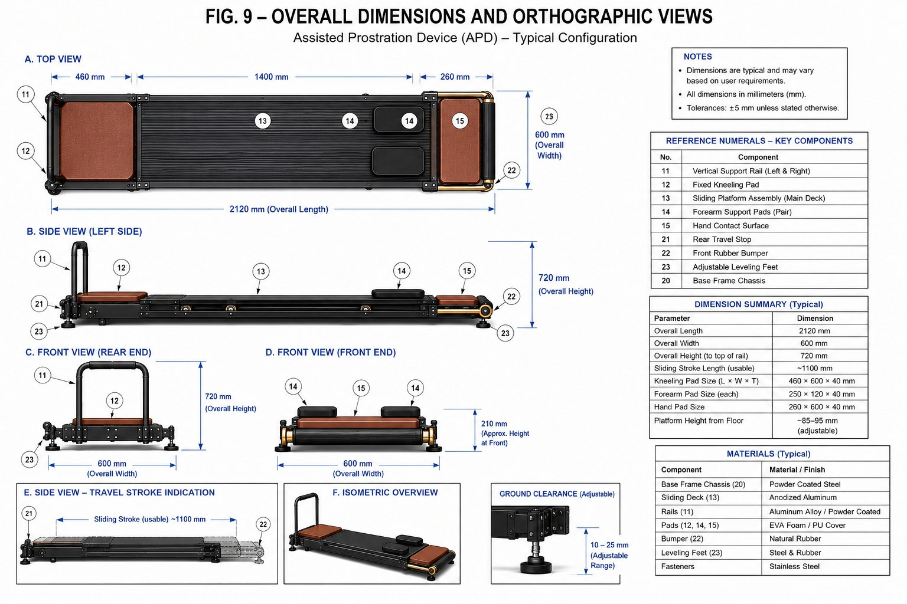

# Assisted Prostration Device (APD)

**Open Hardware Platform for Devotional and Rehabilitative Kneeling Assistance**

[](https://ohwr.org/project/cernohl/wikis/Documents/CERN-OHL-version-2)
[]()
[](https://doi.org/10.17605/OSF.IO/MQYP6)
[](https://doi.org/10.5281/zenodo.20351494)

---


*Fig. 1 — Assisted Prostration Device in deployed configuration*

---

## What Is This?

The **Assisted Prostration Device (APD)** is a floor-based open hardware platform that reduces cumulative joint loading during repetitive full-body prostration practice. It provides:

- **Guided linear sliding** on sealed ball-bearing rails across a ~1100 mm stroke
- **Passive bi-directional kinetic energy restoration** — stores energy on the way down, returns it on the way up
- **No external power required** for core mechanical function
- **Optional digital cycle counter** with false-count filtering
- **Silent operation** designed for monastery and meditation hall environments

### Who Is It For?

| Tradition | Practice |
|---|---|
| Tibetan Buddhism | Ngondro — 111,111 full prostrations |
| Hinduism | Dandavat pranama |
| Islam | Salah rakat assist for elderly / injured |
| Clinical | Rehabilitative kneeling therapy |
| General | Any elderly or injured practitioner needing kneeling support |

---

## How It Works


*Fig. 8 — Four-stage prostration cycle with kinetic restoration*

The practitioner kneels on the fixed rear pad, rests forearms and hands on the sliding platform, and performs the **complete traditional prostration motion**. The platform glides forward on precision bearings. The Kinetic Restoration Subsystem (KRS) inside the base frame stores energy during forward extension and returns it to assist the rising phase — reducing eccentric knee loading by approximately 25–40% of upper body mass.

**The device does not shorten or alter the prostration gesture. The complete motion is preserved.**

---

## Five Mechanical Embodiments

Choose the one that matches your build capability:

| Embodiment | Mechanism | Build Difficulty | India Cost (approx.) |
|---|---|---|---|
| **C1** | Extension spring / elastomeric cord | ⭐ Easy | ₹500–800 |
| **C2** | Gas compression struts | ⭐⭐ Moderate | ₹1,500–2,500 |
| **C3** | Counterweight and pulley | ⭐⭐ Moderate | ₹1,000–2,000 |
| **C4** | Cam-based nonlinear resistance | ⭐⭐⭐ Advanced | ₹2,000–3,500 |
| **C5** | Magnetic eddy-current damping | ⭐⭐⭐ Advanced | ₹3,000–5,000 |

**For a first build: start with C1 or C2.**


*Fig. 5 — Kinetic Restoration Subsystem interior showing spring (261), gas strut (264), cam plate (267), and cantilever arm (268)*

---

## Key Specifications

| Parameter | Value |
|---|---|
| Overall Length | 2120 mm |
| Overall Width | 600 mm |
| Height to rail top | 720 mm |
| Sliding Stroke (usable) | ~1100 mm |
| Rail Height (adjustable) | 520–720 mm |
| Maximum Safe Working Load | 150 kg |
| Device Weight | 28–35 kg (by configuration) |
| Rolling Elements | 2RS Sealed Ball Bearings, 40 mm dia., PU tread |
| Frame Material | Powder-coated steel |
| Rails | Aluminium Alloy 6061-T6 |
| Return Force Calibration | 25–40% of upper-body mass |
| Power Required | None (passive mode) |

---

## Repository Structure

```
apd-prostration-device/
├── README.md                          ← You are here
├── LICENSE                            ← CERN OHL-S v2
├── docs/
│   ├── APD_Specification_v1.0.pdf    ← Full technical specification (13 sections)
│   ├── APD_TechRxiv_Paper.pdf        ← Engineering preprint
│   ├── APD_OSF_Deposit.pdf           ← OSF/Zenodo cover + spec (prior art record)
│   ├── bom.csv                       ← Bill of materials with sourcing
│   ├── assembly-guide.md             ← Step-by-step build guide
│   └── figures/
│       ├── fig1_perspective.png      ← Overall APD perspective view
│       ├── fig2_side_view.png        ← Side view, linear motion path
│       ├── fig3_top_plan.png         ← Top plan view labelled
│       ├── fig4_exploded.png         ← Exploded subsystem breakdown
│       ├── fig5_krs_inside.png       ← Kinetic Restoration Subsystem detail
│       ├── fig6_sliding_platform.png ← Sliding Platform Assembly detail
│       ├── fig7_support_rails.png    ← Support Rail Assembly detail
│       ├── fig8_operation_sequence.png ← Four-stage operation sequence
│       ├── fig9_dimensions.png       ← Orthographic views and dimensions
│       └── fig10_component_breakdown.png ← Full component exploded view
```

---

## Bill of Materials — India Build (C1 Embodiment, Summary)

Full BOM with part numbers and sourcing in [`docs/bom.csv`](docs/bom.csv)

| Component | Source | Approx. Cost |
|---|---|---|
| Steel base frame (local fabrication) | Local metal shop | ₹3,000–5,000 |
| Aluminium channel rails (2m) | Amazon India / industrial supplier | ₹800–1,200 |
| Sealed ball-bearing castors × 6 | Amazon India / bearing supplier | ₹600–900 |
| Aluminium tube for uprights | Local aluminium supplier | ₹1,000–1,500 |
| EVA foam pads (kneeling + forearm + hand) | Amazon India / foam supplier | ₹500–800 |
| Extension springs / bungee cords (C1) | Amazon India | ₹300–500 |
| Miscellaneous fasteners, rubber feet, paint | Hardware shop | ₹400–600 |
| **Total (C1, excluding labour)** | | **₹6,600–10,500** |

---

## Electronics (Optional Counter)

The counting module uses:
- Arduino Nano (₹300)
- Force-sensitive resistor under kneeling pad (₹150)
- 4-digit 7-segment LED display (₹80)
- Lithium-polymer rechargeable cell (₹200)

**Counting logic:** A finite-state machine registers one count only when pad pressure drops below threshold (full extension) AND recovers above threshold (return to kneeling). Robe adjustments, knee shifts, and partial movements are filtered as noise.

A mechanical tally counter cable-tied to the rail also works perfectly.

---

## Figures


*Fig. 2 — Side view showing ~1100 mm sliding stroke*


*Fig. 6 — Sliding Platform Assembly with rolling elements, contact surfaces, and travel stops*


*Fig. 7 — Support Rail Assembly with height adjustment detail (520–720 mm)*


*Fig. 9 — Overall dimensions and orthographic views*

---

## Licence

Released under **[CERN Open Hardware Licence Version 2 — Strongly Reciprocal (CERN OHL-S v2)](LICENSE)**.

You are free to:
- Use this design for any purpose
- Study and modify the design
- Manufacture and distribute products based on this design

You must:
- Release all modified versions under CERN OHL-S v2
- Provide all design source files when distributing
- Attribute the original design to Joy Bose

Full licence text: [ohwr.org/project/cernohl](https://ohwr.org/project/cernohl/wikis/Documents/CERN-OHL-version-2)

---

## Prior Art Record

This design is publicly disclosed as open hardware to prevent patent enclosure. Timestamped records:

- **OSF:** https://doi.org/10.17605/OSF.IO/MQYP6
- **Zenodo:** https://doi.org/10.5281/zenodo.20351494

These records establish prior art. No one may patent this design or any design that does not substantially differ from it.

---

## Citation

If you use this design in research or build documentation, please cite:

```
Bose, J. (2026). Assisted Prostration Device (APD): An Open Hardware Platform
for Bi-Directional Kinetic Restoration in Repetitive Devotional and
Rehabilitative Kneeling Practice. v1.0. CERN OHL-S v2.
github.com/joyboseroy/apd-prostration-device
```

---

## Contact / Contributing

- Open an **Issue** for questions, build notes, or design suggestions
- Open a **Pull Request** to contribute improvements
- For monastery or Dharma centre enquiries: [add contact]

If you build one — please share photos in the Issues tab. The community benefits from seeing real builds.

---

*Designed for practitioners who cannot stop practicing.*
